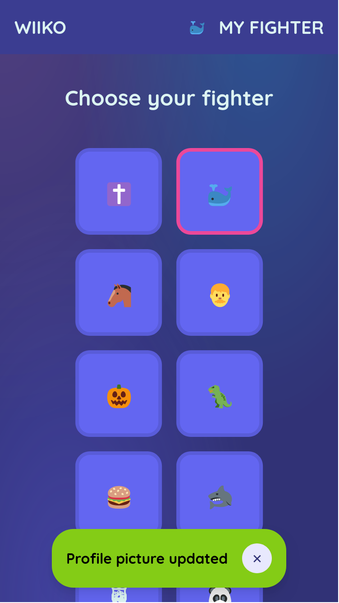

# WiiKO - a Tee K.O. clone for the Nintendo Wii

## Description

Tee K.O. is a minigame from the Jackbox Party Pack 3 that pits players against each other in a competition to design the coolest t-shirt. Players use their mobile devices to draw designs for shirts and write slogans to go with them. They then combine other players' submissions to create a t-shirt for competing. The shirts are put into a bracket and players vote on the best out of each pair. The last shirt standing wins!

## Project Status

This is the fourth iteration of WiiKO. While there is still much to do to finish the game, I have a lot of experience and old code to steal from.

### Previous Iterations

1. Try to interface with official Jackbox servers (questionably legal)
2. Write the game in Zig (following the zeitgeist didn't get anything done)
3. Have all mobile clients connect to the Wii (Wii internet hardware is too inconsistent to provide good playable experience)
4. Have the game state managed by an external server with the Wii controlling state transistions (we are here)

### Current Status

The game server is in its early stages, but much planning has gone into how it will communicate with players and the Wii. 

The mobile client is mostly complete since the UI and some functionality can be reused from iteration 3.

The Wii game is in its early stages. However, much networking and gamestate code can be reused from iteration 3. Graphics are a new addition to this iteration however.

## Screenshots

Mobile Client

Wii (very early)

## Project Structure

- `docs/` includes images and markdown used for documentation
- `frontend/` contains the Svelte frontend used by mobile clients to play the game
- `server/` is the Rust-based websockets server that manages interactions with the mobile clients and holds the game state
- `wiiko/` is the actual Wii game that tells the websocket server when to do state transitions
- `wiiko-old/` is the source for wiiko iteration 3 (see above)